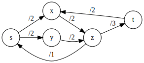
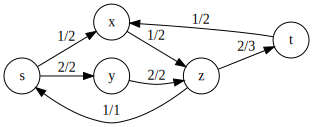
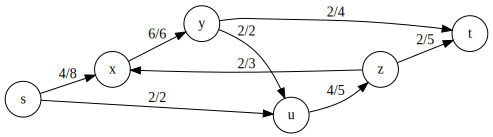

# TD 4 -- UE Graphes et Recherche arborescente -- Flots Maximums

## Exercice 1

> Soit `G` le réseau défini par les listes de successeurs ``s -> (x, y)``, ``x -> (z)``, ``y -> (z)``, ``z -> (s, t)`` et ``t -> (x)``, et les capacités ``c(s, x) = 2``, ``c(s, y) = 2``, ``c(x, z) = 2``, ``c(y, z) = 2``, ``c(z, s) = 1``, ``c(z, t) = 3`` et ``c(t, x) = 2``.

On visualise le graphe ainsi :

### Q1.

**__Question :__**

> Considérons l'application `f_1` définie sur l'ensemble des arcs de `G` par ``f_1(s, x) = 1``, ``f_1(s, y) = 2``, ``f_1(x, z) = 1``, ``f_1(y, z) = 2``, ``f_1(z, s) = 1``, ``f_1(z, t) = 2`` et ``f_1(t, x) = 1``.
> L'application `f_1` est-elle un flot ? Si tel est le cas, donner sa valeur.

On visualise le graphe ainsi :

**__Réponse :__**

Le flot n'est pas conservé en `x` : son flot sortant est de `1` alors que son flot entrant est de ``1+1 = 2``.

En conséquence, ``f_1`` n'est pas un flot.

### Q2.

**__Question :__**

> Même question avec l'application ``f_2`` définie par ``f_1(s, x) = 1``, ``f_1(s, y) = 2``, ``f_1(x, z) = 2``, ``f_1(y, z) = 2``, ``f_1(z, s) = 1``, ``f_1(z, t) = 3`` et ``f_1(t, x) = 1``.
> L'application `f_2` est-elle un flot ? Si tel est le cas, donner sa valeur.

On visualise le graphe ainsi :

**__Réponse :__**

Étudions l'application ``f_2`` :
1. Respect des valeurs : *__oui__*, chaque valeur de ``f_2(x_1, x_2)`` est strictement positive et inférieure ou égale à ``c(x_1, x_2).
2. Étude du flot :
   - En `x` : ``(f^+)(x) = 2     = 1 + 1 = (f^-)(x)``
   - En `y` : ``(f^+)(y) = 2             = (f^-)(y)``
   - En `z` : ``(f^+)(z) = 3 + 1 = 2 + 2 = (f^-)(z)``
Donc ``f_2`` est un flot de valeur ``|f_2| = (f^+)(s) - (f^-)(s) = 2 + 1 - 1 = 2``.

## Exercice 2

> *Rappel :* une __chaîne augmentante__ pour un flot `f` d'un réseau `G` est une suite de sommets de `G` deux-à-deux distincts de la forme ``s = x_0, x_1, ... x_k = t`` (avec ``k >= 1``) où, pour tout ``i \in {0, 1, ... k -1}``, une des deux conditions suivantes est vérifiée :
> 1. Le couple ``(x_i, x_(i+1))`` est un arc de `G` et ``f(x_i, x_(i+1)) < c(x_i x_(i+1))``, où ``c(x_i, x_(i+1))`` est la capacité de ``(x_i, x_(i+1))``.
> 2. Le couple ``(x_i, x_(i+1))`` est un arc de `G` et ``f(x_i, x_(i+1)) > 0``.
>
> Dans le premier cas, on pose ``\delta_i = c(x_i, x_(i+1)) - f(x_i, x_(i+1))`` et dans le second ``\delta_i = f(x_(i+1), x_i)``. La __capacité résiduelle__ de la chaîne augmentante est le plus petit des nombres ``\delta_i`` pour ``i \in {0, 1, ... k-1}``.
>
> Soit `G` le réseau défini par :
> - Les listes de successeurs ``s -> (x, u)``, ``x -> (y)``, ``y -> (u, t)``, ``u -> (z)`` et ``z -> (x, t)``
> - Les capacités ``c(s, x) = 8``, ``c(s, u) = 2``, ``c(x, y) = 6``, ``c(y, u) = 2``, ``c(y, t) = 4``, ``c(u, z) = 5``, ``c(z, x) = 3`` et ``c(z, t) = 5``.
> 
> Considérons le flot `f` défini par : ``f(s, x) = 2``, ``f(s, u) = 2``, ``f(x, y) = 4``, ``f(y, u) = 2``, ``f(y, t) = 2``, ``f(u, z) = 4``, ``f(z, x) = 2`` et ``f(z, t) = 2``.

On visualise le graphe ainsi :

### Q1

**__Question :__**

> Trouver des *une chaîne augmentante* pour `f`. Augmenter `f` le long de cette chaîne d'une quantité égale à sa *capacité résiduelle*.

**__Réponse :__**

``[s -> x -> y -> t]`` est une chaîne augmentante de capacité résiduelle `2`.

On augmente et visualise le graphe ainsi :

### Q2

**__Question :__**

> Vérifier que la valeur du nouveau flot obtenu dans la question `1` n'est pas le maximum en donnant une chaîne augmentante pour ce flot et augmenter le flot le long de cette chaîne d'une quantité égale à sa capacité résiduelle.

**__Réponse :__**

``[s -> x -> z -> t]`` est une chaîne augmentante de capacité résiduelle ``2 = min(4, 2, 3)``.

### Q3

**__Question :__**

> Justifier que le nouveau flot obtenu en question `2` est maximum. Vous utiliserez pour cela la notion de *coupe*.

**__Réponse :__**

La valeur du flot est ``6 + 2 = 8``. On cherche donc à savoir si il existe une coupe de capacité `8`.

Or, la coupe ``{s, x}`` a une capacité de ``2 + 6 = 8``, qui est donc aussi la valeur du flot. Donc, d'après le théorème __max/coupemin__, la flot est maximum.

## Exercice 3 & 4 sautés

## Exercice 5

### Q1

**__Question :__**

**__Réponse :__**

On utilise l'algorithme de **__Ford-Fulkerson__**. Le flot est initialisé à `0`. On trouve des chaîne augmentantes :
- ``Paris -> Bernay -> Mézidon -> Caen`` de capacité résiduelle `2`
- ``Paris -> Rouen -> Cabourg -> Caen`` de capacité résiduelle `3`.
- ``Paris -> Bernay -> Lisieux -> Cabourg -> Caen`` de capacité résiduelle `1`.
- ``Paris -> Alençon -> Argentan -> Granville -> lisieux -> Caen`` de capacité résiduelle `2`
- ``Paris -> Alençon -> Argentan -> Mézidon -> Bernay -> Lisieux -> Cabourg -> Caen`` de capacité résiduelle `2`

On obtient cette version du graphe :

<!-- CREER ET INSERER MODELISATION DU GRAPHE -->

Le nombre de trains maximal (la valeur du flot) est donc de ``10 = 4 + 3 + 3``.

### Q2 

**__Question :__**

**__Réponse :__**

``{Paris, Alençon, Argentan, Mézidon, Granville}`` est une coupe de capacité ``2 + 2 + 3 + 3 = 10`` qui est aussi la valeur du flot. Donc, d'après le théorème __max/coupemin__, le flot est maximal (et la coupe est minimale).

### Q3

**__Question :__**

**__Réponse :__**

Non, on peut le faire en `4` étapes :

- ``Paris -> Rouen -> Cabourg -> Caen`` (``\delta = 4``)
- ``Paris -> Rouen -> Lisieux -> Cabourg`` (``\delta = 3``)
- ``Paris -> Alençon -> Argentan -> Mézidon -> Caen`` (``\delta 2``)
- ``Paris -> Alençon -> Argentan -> Granville -> Lisieux -> Caen`` ``(\delta = 2``)